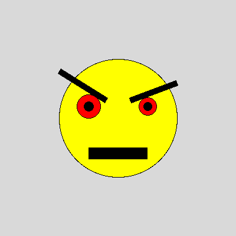
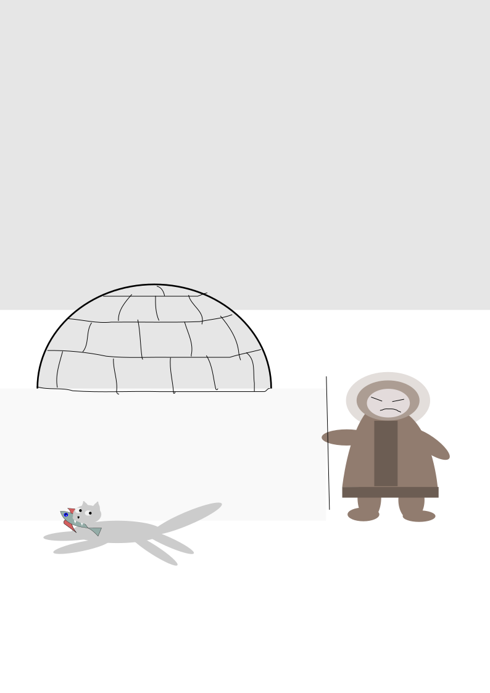
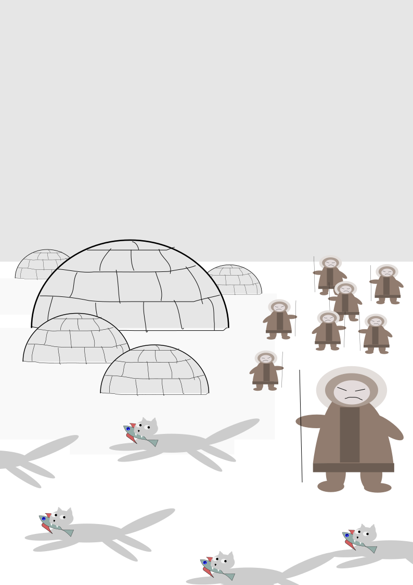

# Лабораторная работа №2

**Вариант 22** (вариант 5 по списку: 5, 12, 19, 22, 27)

Курс: Языки программирования (1 курс, 2 семестр)
Технологии: Git, GitHub, Pygame

---

## Оглавление

- [Git и GitHub](#git-и-github)
  - [Упражнение 1. Git](#упражнение-1-git)
- [Создание картинок с библиотекой Pygame.draw](#создание-картинок-с-библиотекой-pygamedraw)
  - [Установка и подключение библиотеки](#установка-и-подключение-библиотеки)
  - [Пример №1](#пример-№1)
  - [Пример №2](#пример-№2)
  - [Задание №1](#задание-№1)
  - [Задание №2](#задание-№2)
  - [Задание №3](#задание-№3)

---

## Git и GitHub

Система управления версиями (CVS) - один из основных инструментов программиста. Система управления версиями позволяет хранить несколько версий одного и того же документа, при необходимости возвращаться к более ранним версиям, определять, кто и когда сделал то или иное изменение, и многое другое.

Git --- одна из самых популярных систем контроля версиями (CVS). Автор git --- Линус Торвальдс.

GitHub --- крупнейший веб-сервис для хостинга IT-проектов и их совместной разработки.

### Упражнение 1. Git

Пройдите туториал и продемонстрируйте преподавателю тестовый репозиторий на гитхабе.

1. Зарегистрируйтесь на **[github.com](https://github.com)** с некоторым именем пользователя.

2. Создаем новый репозиторий **[https://github.com/new](https://github.com/new)** (или значок + в правом верхнем углу):
   - В качестве имени репозитория задаем PL_2026
   - Доступ оставляем Public
   - Не забываем поставить галочку "Initialize this repository with a README"

3. Откройте терминал (консоль) GNU/Linux или командную строку Git-bash под MS Windows. Теперь git clone --- склонируем получившийся репозиторий на свой компьютер и зайдем в папку с репозиторием:

```
$ git clone https://github.com/Ivanov/PL_2026
Cloning into PL_2026'...
remote: Counting objects: 3, done.
remote: Total 3 (delta 0), reused 0 (delta 0), pack-reused 0
Unpacking objects: 100% (3/3), done.
$ ls
PL_2026
$ cd PL_2026
$ ls
README.md
```

Не забудем сконфигурить гит, представившись ему (это обязательно нужно сделать находясь в папке PL_2026):

```
git config user.name "Ivanov Ivan"
git config user.email ivanov.ivan@someuniversity.edu
```

Почту указываем как при регистрации.

4. Теперь у нас локально есть полная и независимая версия нашего репозитория PL_2026. Она никак явным образом не связана с версией на серверах github'а, однако в гите существуют инструменты для обмена данными между разными репозиториями. Иными словами, git - это распределенная система управлениями версиями.

5. Команда **git log** возвращает историю нашего репозитория. В данный момент в нашей истории ровно один коммит (коммит - это некоторый набор изменений).

```
$ git log
commit eec733a21cerfb66973991a9357aab735fa40ba4
Author: Ivanov <ivanov.ivan@someuniversity.edu>
Date: Wed Sep 16 12:06:08 2020 +0300
    Initial commit
```

6. Давайте отредактируем файл README.md и добавим в него что-нибудь. Откроем файл README.md и напишем в нем что-нибудь. После с помощью **git diff** посмотрим на текущие изменения. В "диффе" видно, что была добавлена строчка "it's test project".

```
$ git diff
diff --git a/README.md b/README.md
index 21e60f8..285eafa 100644
--- a/README.md
+++ b/README.md
@@ -1 +1,3 @@
-# PL_2026
\ No newline at end of file
+# PL_2026
+
+it's test project
```

7. Команда **git status** показывает текущий статус репозитория. Мы видим, что сейчас мы находимся в ветке master (основная ветка нашего репозитория). Ниже написано, что файл README.md был изменен. Однако он ещё не готов для коммита.

```
$ git status
# On branch master
# Changes not staged for commit:
#   (use "git add <file>..." to update what will be committed)
#   (use "git checkout -- <file>..." to discard changes in working directory)
#
#   modified: README.md
#
no changes added to commit (use "git add" and/or "git commit -a")
```

8. Сделаем **git add**, как рекомендует нам команда status.

```
$ git add README.md
$ git status
# On branch master
# Changes to be committed:
#   (use "git reset HEAD <file>..." to unstage)
#
#   modified: README.md
#
```

Теперь **git status** показывает, что изменения в файле README.md готовы для коммита. Если сейчас снова изменить README.md, то нужно снова обязательно выполнить **git add**.

9. **git commit** --- закоммитим наши изменения, то есть внесём "квант" изменений в историю развития проекта:

```
$ git commit -m "Added something to README"
[master 274f6d5] Added something to README
Committer: Ivanov Ivan <ivanov.ivan@someuniversity.edu>
1 file changed, 3 insertions(+), 1 deletion(-)
```

10. Снова посмотрим (**git log**) на историю нашего репозитория:

```
$ git log
commit 8e2642d512b11ae43a97b0b4ac68e802d2626f14
Author: Ivanov Ivan <ivanov.ivan@someuniversity.edu>
Date: Wed Nov 9 14:47:40 2016 +0300
    Added something to README
commit eec733a21cerfb66973998a9327aab735fa40ba4
Author: Ivanov Ivan <ivanov.ivan@someuniversity.edu>
Date: Wed Nov 9 13:36:38 2016 +0300
    Initial commit
```

Теперь в нашем репозитории два коммита.

11. Давайте сделаем **git push** --- отправим ("запушим" на сленге программистов) наши изменения в оригинальный репозиторий на github.com.

```
$ git push
Username for 'https://github.com': <username>
Password for 'https://ivanov@github.com': <password>
To https://github.com/Ivanov/PL_2026
   eec733a..8e2642d master -> master
```

При git push необходимо будет ввести логин и пароль на GitHub. Теперь изменения будут доступны для всех.

12. Существует парная команда **git pull** --- которая забирает изменения с оригинального репозитория на сервере.

```
$ git pull
Already up-to-date.
```

---

## Создание картинок с библиотекой Pygame.draw

На этом занятии вы будете рисовать графические объекты на языке Python.

Откройте папку со своим репозиторием PL_2026, который вы создали в GitHub и склонировали на локальный компьютер.

Создайте в нём вложенную папку lab2. Все файлы этой лабораторной работы сохраняйте в эту папку, чтобы затем добавить их в репозиторий, закоммитить и "запушить" на сервер для сдачи преподавателю.

### Установка и подключение библиотеки

Для установки библиотеки следуйте инструкциям на [pygame.org](https://www.pygame.org)

Чтобы импортировать возможности библиотеки Pygame в вашей программе недостаточно одной инструкции import, нужны ещё некоторые дополнительные действия:

```python
import pygame

# После импорта библиотеки, необходимо её инициализировать:
pygame.init()

# И создать окно:
screen = pygame.display.set_mode((300, 200))

# здесь будут рисоваться фигуры
# ...

# после чего, чтобы они отобразились на экране, экран нужно обновить:
pygame.display.update()

# Эту же команду нужно будет повторять, если на экране происходят изменения.

# Наконец, нужно создать основной цикл, в котором будут отслеживаться
# происходящие события.
# Пока единственное событие, которое нас интересует - выход из программы.
while True:
    for event in pygame.event.get():
        if event.type == pygame.QUIT:
            pygame.quit()
```

Помимо команды import pygame для более удобного доступа к функциям рисования, можно дополнительно прописать ещё одну строку импорта:

```python
import pygame
from pygame.draw import *
```

Это позволит вместо pygame.draw.rect(...) писать просто rect(...).

Также хорошей практикой является добавление небольшой задержки в главный цикл программы, чтобы не заставлять ее работать "вхолостую", постоянно считывая события, которых, скорее всего, нет. Для этого в pygame есть специальный модуль time. До начала главного цикла создаем объект Clock:

```python
clock = pygame.time.Clock()
```

После этого в главном цикле добавляем строку:

```python
clock.tick(30)
```

Здесь 30 - это максимальный FPS, быстрее которого программа работать не будет. Естественно, можно указать и любое другое значение (которое, кстати, есть смысл записать в отдельную переменную для легкого доступа).

### Пример №1

Выведем простую картинку. Создайте файл 1_draw.py, скопируйте туда текст примера №1 и запустите.

```python
import pygame
from pygame.draw import *

pygame.init()

FPS = 30
screen = pygame.display.set_mode((400, 400))

rect(screen, (255, 0, 255), (100, 100, 200, 200))
rect(screen, (0, 0, 255), (100, 100, 200, 200), 5)
polygon(screen, (255, 255, 0), [(100,100), (200,50), (300,100), (100,100)])
polygon(screen, (0, 0, 255), [(100,100), (200,50), (300,100), (100,100)], 5)
circle(screen, (0, 255, 0), (200, 175), 50)
circle(screen, (255, 255, 255), (200, 175), 50, 5)

pygame.display.update()
clock = pygame.time.Clock()
finished = False

while not finished:
    clock.tick(FPS)
    for event in pygame.event.get():
        if event.type == pygame.QUIT:
            finished = True

pygame.quit()
```

### Пример №2

Для создания штриховок можно использовать циклы:

```python
import pygame
from pygame.draw import *

pygame.init()

FPS = 30
screen = pygame.display.set_mode((400, 400))

x1 = 100; y1 = 100
x2 = 300; y2 = 200
N = 10
color = (255, 255, 255)

rect(screen, color, (x1, y1, x2 - x1, y2 - y1), 2)
h = (x2 - x1) // (N + 1)
x = x1 + h

for i in range(N):
    line(screen, color, (x, y1), (x, y2))
    x += h

pygame.display.update()
clock = pygame.time.Clock()
finished = False

while not finished:
    clock.tick(FPS)
    for event in pygame.event.get():
        if event.type == pygame.QUIT:
            finished = True

pygame.quit()
```

Все функции модуля pygame.draw в качестве первого аргумента принимают экран, на котором нужно рисовать (приложение может открывать и несколько окон, нужно точно знать, на каком рисовать). Второй аргумент - цвет, заданный кортежем из трех чисел от 0 до 255 в формате RGB. Также возможно наличие четвертого числа - прозрачности. После этого следуют координаты фигуры (для каждой фигуры свой формат задания координат), далее - параметр width. Если передать в этот параметр положительное значение, оно будет означать толщину линии. Если параметр равен 0 (значение по умолчанию), фигура будет полностью закрашенной. Полное описание функций модуля pygame.draw вы можете найти в официальной документации.

### Задание №1

Первое задание-картинка одинаковое у всех. Нарисовать злой смайлик.

```

```

### Задание №2 (Вариант 22)

Второе задание-картинка по вариантам. Вариант 5.

```

```

### Задание №3 (Вариант 22)

Третье задание является усложнённой версией второго. Вам придётся выполнить модификацию своей программы. Вариант 5.

```

```

---

**Важно!** Результат вашей работы обязательно нужно отправить в свой репозиторий.
